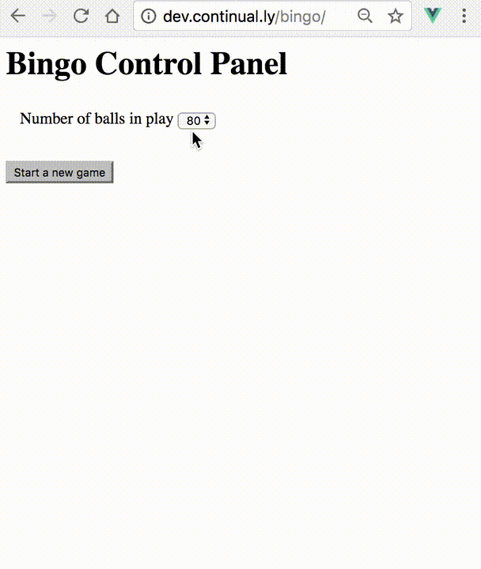
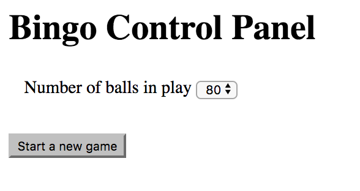
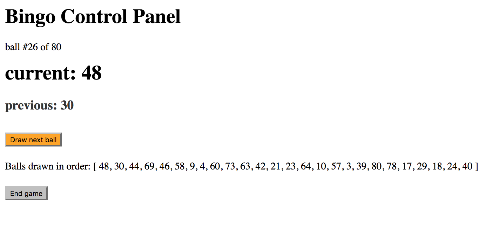
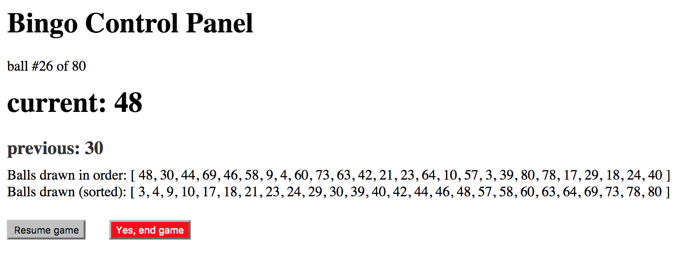

# PSA Bingo

Host a bingo night in a school without a working internet connection.

## Assumptions

* bingo cards are pre-printed (sourced from elsewhere)
* a projector is available which can be linked to a laptop
* a local webserver can run on laptop

# Control Panel - in Action!

# Screenshots

## Control Panel - initial view

## Control Panel - mid game

## Control Panel - end game - step 1 of 2

You can choose to resume the game, or end it.

You can check the bingo card against the numbers drawn (which have been sorted into ascending order for ease of checking).

# Planned Feature Set

* cache the numbers drawn in case of problems
  * ability to resume game after power outage etc...
* no internet connection
* configurable:
  * number of balls
  * school name
  * intro / messages /credits
  * ball drawn messages
* controls:
  * new game
  * draw ball manually
  * winner announcement
  * resume game
  * check bingo card
  * timer for automated draws (configurable length)
* duration timer - how long game runs for
* display board
  * show ball drawn in large print
  * show previous ball(s)
  * responsive design
* admin view
  * current ball
  * previous ball
  * history of all balls drawn
    * in order drawn
    * in numeric order
  * launch new game
  * end game
  * resume game
  * announce winner
  * draw ball
  * pause game
  * config editor
  
  ## Views
  
  ### Display board
  
  * waiting to start
  * welcome
  * instructions
  * show ball
    * previous ball
  * winner
  * end of game
  * thank you
  * credits
  * break time message (tea/coffee outside, resume in 15 minutes etc)

  ### Admin screen
  
  * config editor
    * school name
    * school logo
    * colour scheme
    * font choice
    * font size
    * ball messages
    * intsructions
    * credits/thanks
    * welcome message
    * winner announcement message
    * next fundraising event announcement
    * break time announcement
  * show initial screen
  * show welcome screen
  * show instructions
  * new game
  * draw ball
    * allow use of spacebar to draw next ball
  * show dialogue for ball - "key of the door, blind 30 etc"
  * show previous ball(s)
  * check winner card
  * announce winner
  * resume game
  * pause game
  * game timer
  * manual or auto draw balls
  * in-game announcements: number of balls to go
    * 10 down, half way, 10 to go etc
    * anyone need 1 ball to win? 2? 3?
  * show break time announcement
